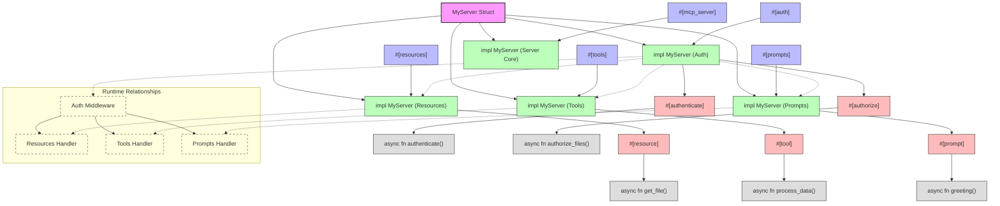
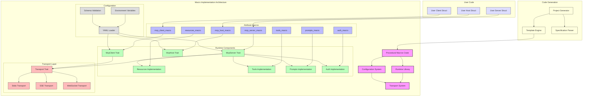

```mermaid
graph TD
    %% Main nodes
    Server[MyServer Struct]
    
    %% Macro nodes
    MCP["#[mcp_server]"]
    RES["#[resources]"]
    TOOLS["#[tools]"]
    PROMPTS["#[prompts]"]
    AUTH["#[auth]"]
    
    %% Implementation blocks
    ServerImpl["impl MyServer (Server Core)"]
    ResImpl["impl MyServer (Resources)"]
    ToolsImpl["impl MyServer (Tools)"]
    PromptsImpl["impl MyServer (Prompts)"]
    AuthImpl["impl MyServer (Auth)"]
    
    %% Child attribute nodes
    Resource["#[resource]"]
    Tool["#[tool]"]
    Prompt["#[prompt]"]
    Authenticate["#[authenticate]"]
    Authorize["#[authorize]"]
    
    %% Methods
    ResMethod["async fn get_file()"]
    ToolMethod["async fn process_data()"]
    PromptMethod["async fn greeting()"]
    AuthMethod["async fn authenticate()"]
    AuthzMethod["async fn authorize_files()"]
    
    %% Connections between struct and impl blocks
    Server --> ServerImpl
    Server --> ResImpl
    Server --> ToolsImpl
    Server --> PromptsImpl
    Server --> AuthImpl
    
    %% Connections between macros and impl blocks
    MCP --> ServerImpl
    RES --> ResImpl
    TOOLS --> ToolsImpl
    PROMPTS --> PromptsImpl
    AUTH --> AuthImpl
    
    %% Connections between child attributes and methods
    Resource --> ResMethod
    Tool --> ToolMethod
    Prompt --> PromptMethod
    Authenticate --> AuthMethod
    Authorize --> AuthzMethod
    
    %% Connections between impl blocks and child attributes
    ResImpl --> Resource
    ToolsImpl --> Tool
    PromptsImpl --> Prompt
    AuthImpl --> Authenticate
    AuthImpl --> Authorize
    
    %% Auth connections to other components
    AuthImpl -.-> ResImpl
    AuthImpl -.-> ToolsImpl
    AuthImpl -.-> PromptsImpl
    
    %% Runtime connections
    subgraph "Runtime Relationships"
        AuthCheck["Auth Middleware"]
        ResHandler["Resources Handler"]
        ToolHandler["Tools Handler"]
        PromptHandler["Prompts Handler"]
        
        AuthCheck --> ResHandler
        AuthCheck --> ToolHandler
        AuthCheck --> PromptHandler
    end
    
    %% Connect implementation to runtime
    AuthImpl -.-> AuthCheck
    ResImpl -.-> ResHandler
    ToolsImpl -.-> ToolHandler
    PromptsImpl -.-> PromptHandler
    
    %% Styling
    classDef struct fill:#f9f,stroke:#333,stroke-width:2px;
    classDef macro fill:#bbf,stroke:#333,stroke-width:1px;
    classDef impl fill:#bfb,stroke:#333,stroke-width:1px;
    classDef attr fill:#fbb,stroke:#333,stroke-width:1px;
    classDef method fill:#ddd,stroke:#333,stroke-width:1px;
    classDef runtime fill:#ffd,stroke:#333,stroke-width:1px,stroke-dasharray: 5 5;
    
    class Server struct;
    class MCP,RES,TOOLS,PROMPTS,AUTH macro;
    class ServerImpl,ResImpl,ToolsImpl,PromptsImpl,AuthImpl impl;
    class Resource,Tool,Prompt,Authenticate,Authorize attr;
    class ResMethod,ToolMethod,PromptMethod,AuthMethod,AuthzMethod method;
    class AuthCheck,ResHandler,ToolHandler,PromptHandler runtime;
```

```mermaid
graph TD
    %% Main components
    subgraph "Macro Implementation Architecture"
        ProcMacros["Procedural Macros Crate"]
        Runtime["Runtime Library"]
        Config["Configuration System"]
        Transport["Transport System"]
        
        %% Macro components
        subgraph "Attribute Macros"
            ServerMacro["mcp_server_macro"]
            ClientMacro["mcp_client_macro"]
            HostMacro["mcp_host_macro"]
            ResourcesMacro["resources_macro"]
            ToolsMacro["tools_macro"]
            PromptsMacro["prompts_macro"]
            AuthMacro["auth_macro"]
        end
        
        %% Runtime components
        subgraph "Runtime Components"
            ServerTrait["McpServer Trait"]
            ClientTrait["McpClient Trait"]
            HostTrait["McpHost Trait"]
            ResourcesImpl["Resources Implementation"]
            ToolsImpl["Tools Implementation"]
            PromptsImpl["Prompts Implementation"]
            AuthImpl["Auth Implementation"]
        end
        
        %% Transport components
        subgraph "Transport Layer"
            TransportTrait["Transport Trait"]
            StdioTransport["Stdio Transport"]
            SSETransport["SSE Transport"]
            WSTransport["WebSocket Transport"]
        end
        
        %% Config components
        subgraph "Configuration"
            YAMLLoader["YAML Loader"]
            EnvVars["Environment Variables"]
            Validation["Schema Validation"]
        end
        
        %% Connections between components
        ProcMacros --> Runtime
        ProcMacros --> Config
        Runtime --> Transport
        Config --> Transport
        
        %% Connections between macros and runtime
        ServerMacro --> ServerTrait
        ClientMacro --> ClientTrait
        HostMacro --> HostTrait
        ResourcesMacro --> ResourcesImpl
        ToolsMacro --> ToolsImpl
        PromptsMacro --> PromptsImpl
        AuthMacro --> AuthImpl
        
        %% Connections within runtime
        ServerTrait --> ResourcesImpl
        ServerTrait --> ToolsImpl
        ServerTrait --> PromptsImpl
        ServerTrait --> AuthImpl
        
        %% Connections to transport
        ServerTrait --> TransportTrait
        ClientTrait --> TransportTrait
        
        %% Transport implementations
        TransportTrait --> StdioTransport
        TransportTrait --> SSETransport
        TransportTrait --> WSTransport
        
        %% Config connections
        YAMLLoader --> ServerTrait
        YAMLLoader --> ClientTrait
        YAMLLoader --> HostTrait
        EnvVars --> YAMLLoader
        Validation --> YAMLLoader
    end
    
    %% Code Generation
    subgraph "Code Generation"
        Generator["Project Generator"]
        Templates["Template Engine"]
        SpecParser["Specification Parser"]
        
        Generator --> Templates
        Generator --> SpecParser
        Templates --> ProcMacros
    end
    
    %% User Code
    subgraph "User Code"
        UserServer["User Server Struct"]
        UserClient["User Client Struct"]
        UserHost["User Host Struct"]
        
        UserServer --> ServerMacro
        UserClient --> ClientMacro
        UserHost --> HostMacro
    end
    
    %% Styling
    classDef component fill:#f9f,stroke:#333,stroke-width:2px;
    classDef macro fill:#bbf,stroke:#333,stroke-width:1px;
    classDef runtime fill:#bfb,stroke:#333,stroke-width:1px;
    classDef transport fill:#fbb,stroke:#333,stroke-width:1px;
    classDef config fill:#ddd,stroke:#333,stroke-width:1px;
    classDef generator fill:#ffd,stroke:#333,stroke-width:1px;
    classDef user fill:#ddf,stroke:#333,stroke-width:1px;
    
    class ProcMacros,Runtime,Config,Transport component;
    class ServerMacro,ClientMacro,HostMacro,ResourcesMacro,ToolsMacro,PromptsMacro,AuthMacro macro;
    class ServerTrait,ClientTrait,HostTrait,ResourcesImpl,ToolsImpl,PromptsImpl,AuthImpl runtime;
    class TransportTrait,StdioTransport,SSETransport,WSTransport transport;
    class YAMLLoader,EnvVars,Validation config;
    class Generator,Templates,SpecParser generator;
    class UserServer,UserClient,UserHost user;
```
